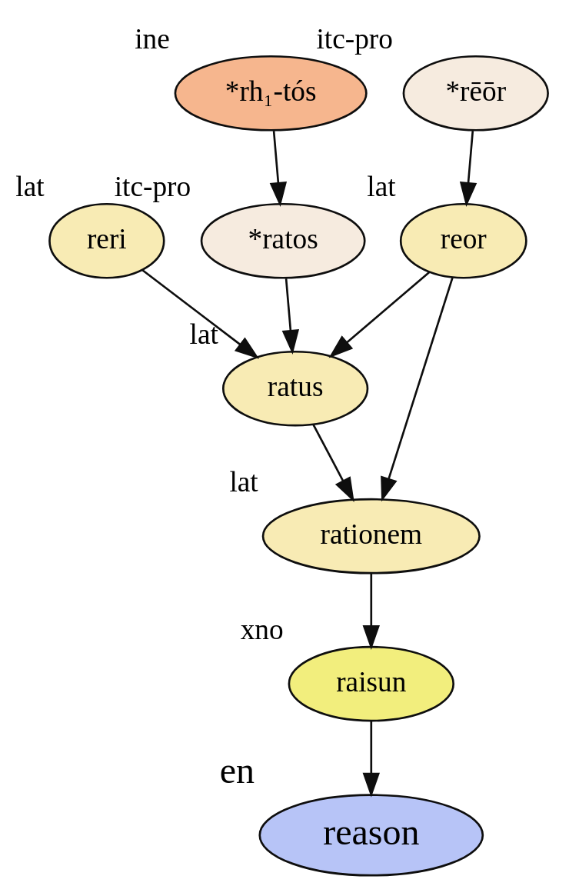

# Beyond Reasoning

* Meta reasoning
* Bounded rationality
* Elements of reasoning in LLMs

## But what is reasoning?

What is **reasoning**?
- **Reasoning** is an English word that comes from the Latin word "ratio". "Ratio" comes from the Latin word "reri", and "reri" means "to think". 

Reasoning in LLMs

## So what?

- What is **reasoning**?

Reasoning is one of the most fundamental cognitive processes that distinguishes human intelligence from other forms of life. It refers to the capacity to draw inferences or conclusions from premises, evidence, or principles. In a broad sense, reasoning involves the mental activity of organizing information and beliefs in order to solve problems, make decisions, and establish beliefs based on logic, experience, and the available information. Reasoning can take many forms, including deductive, inductive, abductive, analogical, and causal reasoning, each of which serves different purposes in thinking and problem-solving. Deductive reasoning allows us to derive specific conclusions from general premises with certainty, provided the premises are true, while inductive reasoning leads to general conclusions based on patterns or repeated observations, though these conclusions are only probable rather than certain. Abductive reasoning generates the most plausible explanation for a set of observations, especially when faced with incomplete information, helping us form hypotheses or quick judgments about real-world situations. Analogical reasoning allows individuals to make comparisons between two domains or systems, applying insights from one to the other, and is commonly used in creative problem-solving and scientific innovation. Causal reasoning, on the other hand, helps individuals understand cause-and-effect relationships, allowing for predictions about how one event might influence another. Various cognitive processes are involved in reasoning, including attention, which focuses on relevant information, memory, which recalls previous knowledge, and language, which structures thoughts and communication. Visual representations and symbols often aid reasoning, especially in complex tasks like mathematical problem-solving. In everyday life, reasoning is crucial for decision-making, whether it's about simple choices like what to eat or major life decisions about careers or finances. It is equally important in education and learning, as reasoning helps students understand new concepts and solve problems in subjects like mathematics and science. Ethical reasoning allows people to navigate moral dilemmas and interpersonal conflicts by balancing logic, emotion, and social values. Reasoning also plays a critical role in social cognition, helping individuals interpret others' behavior, intentions, and emotions to form relationships or resolve conflicts. In technical fields like science, medicine, and engineering, reasoning is indispensable for analyzing data, solving complex problems, and innovating. For example, in scientific inquiry, researchers rely on inductive reasoning to form hypotheses and on deductive reasoning to test them. Medical professionals use abductive reasoning to make diagnoses based on symptoms and patient history. However, reasoning is not infallible and is prone to errors, such as logical fallacies, which can lead to faulty conclusions. Fallacies like ad hominem attacks, slippery slopes, and false dichotomies distort reasoning by misrepresenting or oversimplifying arguments. Cultivating critical thinking skills and being aware of these potential pitfalls can improve the quality of one's reasoning. Ultimately, reasoning is an essential cognitive function that enables humans to navigate complex environments, solve problems, and make informed decisions. It allows for understanding relationships between ideas, predicting outcomes, and forming sound judgments, making it a fundamental aspect of human thought and behavior.

## Context Matters!

    <strong>Context:</strong> It is obvious (to us) that the presenter should talk about meaning of reasoning in a scientific context.  
    This is what <strong>Chain of Thought</strong> is about in language modeling.  
    It gives the <strong>context</strong> to LLMs, such that the probability of each generated token is conditioned on the chain of previous tokens (context).  
    This is the <strong>reasoning</strong> that LLMs do.

## But is this really reasoning in LLMs?
- Reasoning, reciting, or regurgitating?

## Reasoning in LLMs

  <strong>Reasoning</strong> is <em>the cognitive process of drawing conclusions, making decisions, and solving problems</em> based on logical thinking, evidence, and analysis. It involves critical thinking, as well as the use of deduction and induction, to arrive at sound judgments.

  <strong>Reasoning</strong> utilizes <em>existing knowledge</em>, <em>patterns</em>, and principles to form coherent and justified conclusions.

## Factual or Counterfactual?

## Factual or Counterfactual?

## Reversal Curse

Mathematical tools to explore reasoning in LLMs:
* Linear Probes
* Sampling (Decoding)
* LogitLens
* Influence Functions

## Meta Reasoning

* Can we reason without words?

Language and Thought

I-Language and E-Language

## Let's break it down
What is a (causal) language model?
- A language model is a model that can generate human-like text.
  - It is trained on a large corpus of text data. (Seeing and finding patterns in the data)
  - It can generate text by predicting the next word in a sentence.(Sampling from the learned patterns)

## Let's break it down

Good at Deductive Reasoning
- Good at memorizing facts, More parameters, better weights
- Good at deducing facts, Better sampling (Research Gap)

## Bounded Rationality

- Why are we satisfied by “good enough?”
  - Omniscient
  - Omnipotent

    <strong>Bounded rationality</strong> is the idea that when individuals make decisions, their rationality is limited by the information they have, the cognitive limitations of their minds, and the finite amount of time they have to make a decision. It was proposed by <strong>Herbert Simon</strong> as an alternative to the classical theory of rationality, which assumes that people make decisions by optimizing.

## Need more time?
* NO!
* One more reason to be satisfied by "good enough."

## LLMs and Cognitive Biases
* Human survival
* Survivorship bias
* Bounded rationality
* Mental shortcuts

## Biases, Safety, and Ethics
* Now I need more time!
* Constrained decoding

## Cost 

## Research in LLMs and DL

* Herbert A. Simon: "Theories of bounded rationality"

* Bojack Horseman: "Okay, okay. Here’s the secret to doing research in LLMs. Just pretend you are doing research, and eventually, you’ll forget you’re pretending."

## References
- [Reasoning or Reciting? Exploring the Capabilities and Limitations of
Language Models Through Counterfactual Tasks](https://arxiv.org/pdf/2307.02477)
- [Bounded Rationality](https://en.wikipedia.org/wiki/Bounded_rationality)
- [Why are we satisfied by “good enough?”](https://thedecisionlab.com/biases/bounded-rationality)
- [Information-Theoretic Bounded Rationality](https://arxiv.org/pdf/1512.06789)
- [Reasoning skills of large language models are often overestimated](https://news.mit.edu/2024/reasoning-skills-large-language-models-often-overestimated-0711)
- Bojack Horseman Season 4, Episode 7 titled "Underground." 
- Background has been taken from [LessWrong](https://www.youtube.com/watch?v=8kX62n6yNXA)
- [Noam Chomsky - Thought Without Language](https://www.youtube.com/watch?v=5YXXGHwmogU)