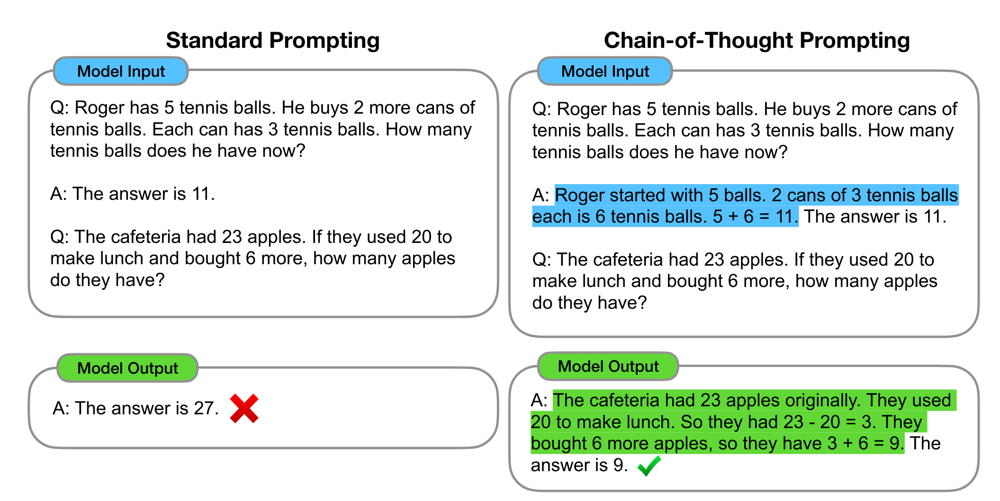
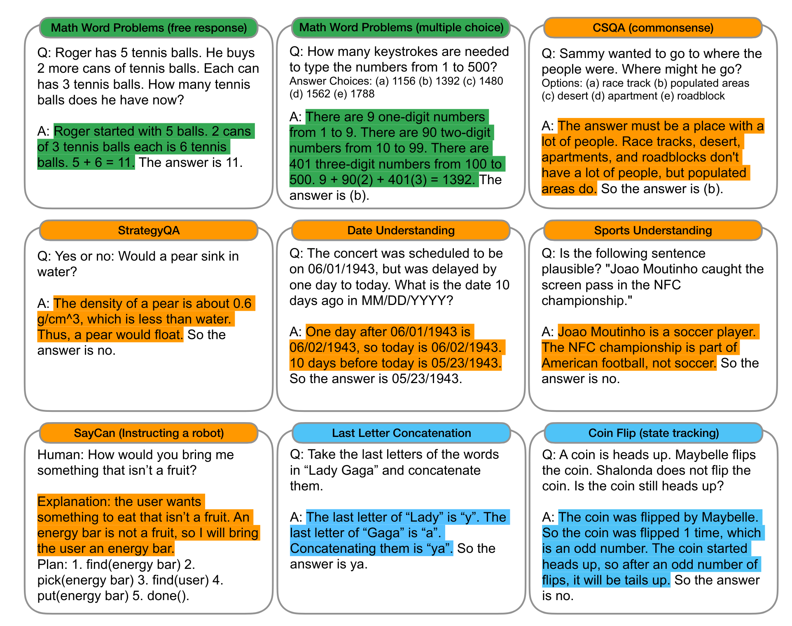
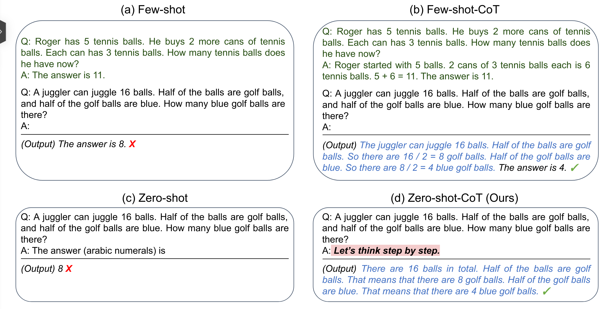
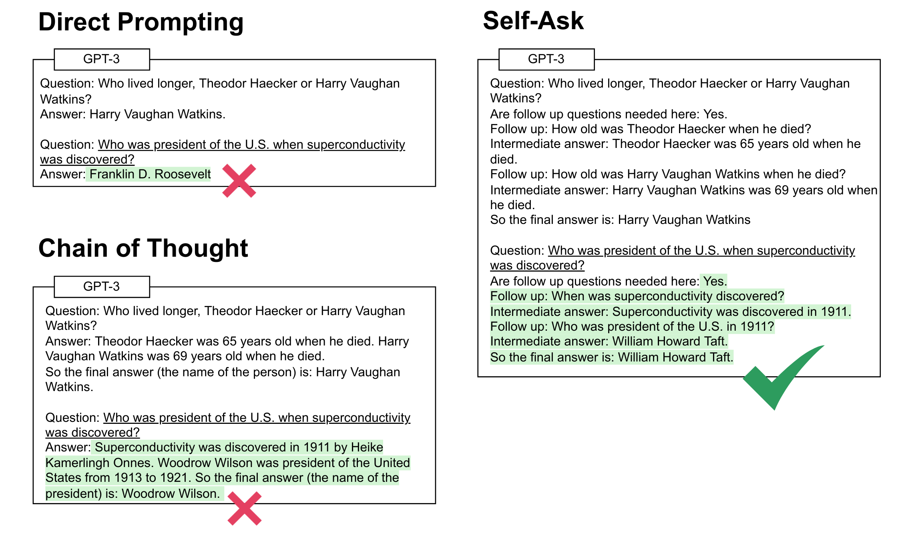
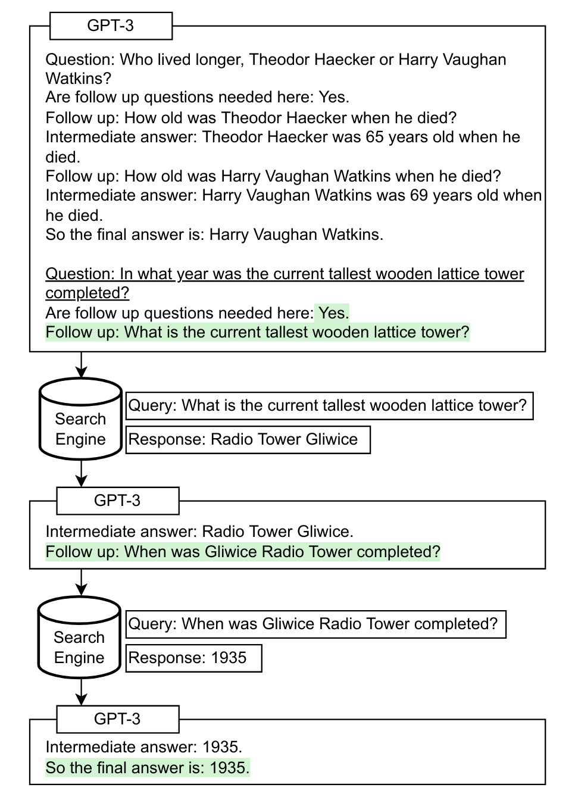
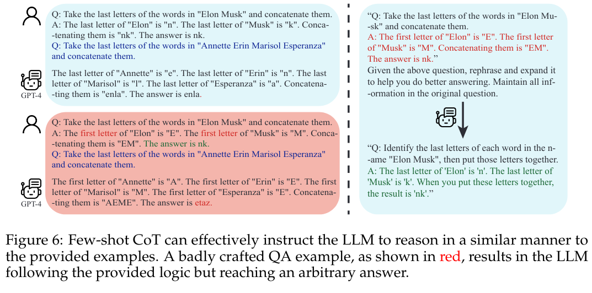
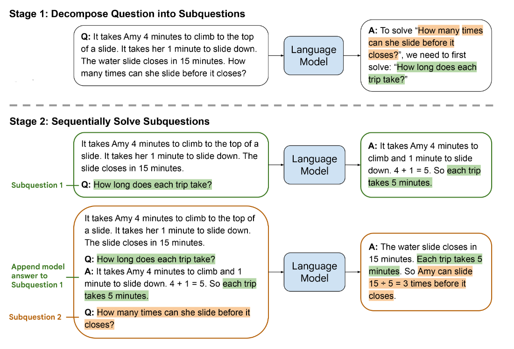
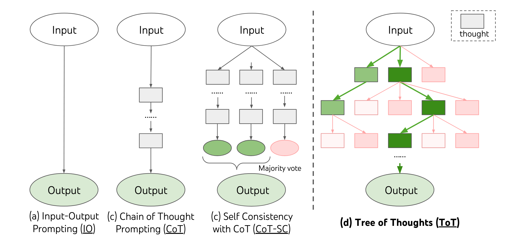

# Reasoning in Large Language Models
Reasoning elicited from model weights.

## Elicit Reasoning

[Chain-of-Thought Prompting Elicits Reasoning in Large Language Models](https://arxiv.org/abs/2201.11903)

- **Chain of Thoughts (CoT)**
    - A series of intermediate reasoning steps.
    - Example:
        - Task: Question Answering
        - input
        - [intermediate steps will be generated]
        - [answer will be generated]

Wide range of tasks:

Contribution:
- Chain of thoughts (CoT) = a series of intermediate reasoning steps
- Instead of asking a question directly, provide a series of intermediate reasoning steps.

## Zero-shot CoT (zero-shot reasoning)

[Large Language Models are Zero-Shot Reasoners](https://arxiv.org/abs/2103.13425)

- **Zero-shot**
    - Model has never trained on the task. (as far as we know!)
    - Questions are asked LLMs without any context.
    - Example:
        - Task: Question Answering
        - input
        - [answer will be generated]

- **Few-shot**
    - Again, model has never trained on the task.
    - But, model is given a few examples of the task as follows:
        - Task: Question Answering
        - Examples: 
            - Q1
            - A1
            ...
            - input
            - [answer will be generated]

- **Few-shot-CoT**
    - Again, model has never trained on the task.
    - Like few-shot, model is given a few examples of the task.
    - But, in each exemplar, model is also given intermediate steps to solve the task.
    - Example:
        - Task: Question Answering
        - Examples: 
            - Q1
            - Intermediate steps to solve Q1
            - A1
            ...
            - input
            - [intermediate steps will be generated]
            - [answer will be generated]

- **Zero-shot-CoT**
    - Again, model has never trained on the task.
    - Unlike few-shot-CoT, model is not given any intermediate steps.
    - The provided prompt encourages the model to generate intermediate steps by adding "Let's think step by step" at the beginning of the prompt.
    - Example:
        - Task: Question Answering
        - input
        - Let's think step by step.
        - [intermediate steps will be generated]
        - [answer will be generated]

Contributions:
- Let's think step by step.

Notes:
- It can be complementary to the CoT. E.g., reasoning steps start with "Let's think step by step" and continue with CoT.

## Re-Reading Prompt

[Re-Reading Improves Reasoning in Large Language Models](https://arxiv.org/abs/2109.07547)

- **Zero-shot-CoT**
    - Let's think step by step.
- **Zero-shot-CoT+Re-Reading**
    - Let's think step by step.
    - Re-read the prompt.
    - "bidirectional" understanding of the prompt.

Contributions:
- Provide a prompt twice.

## Self-Ask

[2210.03350] Measuring and Narrowing the Compositionality Gap in Language Models

Compositional Reasoning:

Cognitive process of understanding complex concepts or systems by breaking them down into their constituent parts and understanding the relationships between these parts.

This method can be used with retrieval information.

## Rephrase and Respond

Rephrase and Respond: Let Large Language Models Ask Better Questions for Themselves

Motivating Example

**Rephrase and Respond**
- One-step RaR
    - {Question}
    - Rephrase and expand the question, and respond.
- Two-step RaR
    - Let Stronger LLMs Rephrase for Weaker LLMs to Respond.
    - step 1:
        - {Question}
        - Given the above question, rephrase and expand it to help you do better answering. Maintain all information in the original question.
    - step 2:
        - {Question}
        - {Rephrased Question}
        - Use your answer to the rephrased question to answer the original question.

Learning from few-shot exemplars:

Contributions:
- Let LLMs ask better questions for themselves by rephrasing and expanding the question.
- "Rephrase and Respond"
- **One-step RaR** and **Two-step RaR**

## Recursive Reasoning

## Recursive Decomposition
Least-to-Most Prompting Enables Complex Reasoning in Large Language Models

- Easy to hard generalization
- Least to most prompting
- In contrast to CoT, least-to-most prompting starts with the simplest form of the task and gradually increases the complexity of the task by asking questions.

Leat-to-Most Prompting:
1. Decomposition. The prompt in this stage contains constant examples that demonstrate the
decomposition, followed by the specific question to be decomposed.
1. Subproblem solving. The prompt in this stage consists of three parts: (1) constant examples demonstrating how subproblems are solved; (2) a potentially empty list of previously
answered subquestions and generated solutions, and (3) the question to be answered next.

## Contrastive Reasoning

## Self-consistency
[Self-Consistency Improves Chain of Thought Reasoning in Language Models](https://arxiv.org/abs/2203.11171)

## Tree of Thoughts

Tree of Thoughts: A Hierarchical Approach to Reasoning in Large Language Models

- Hierarchical reasoning
- Tree of Thoughts (ToT)
- A tree structure that represents the reasoning process of a model.
- Each node in the tree represents a reasoning step.
- Each edge in the tree represents the relationship between the reasoning steps.
- The root node is the input prompt.
- The leaf nodes are the final answers.
- The internal nodes are intermediate reasoning steps.
- The tree structure is constructed by the model itself.
- 

## References
1. [Chain-of-Thought Prompting Elicits Reasoning in Large Language Models](https://arxiv.org/abs/2201.11903)

