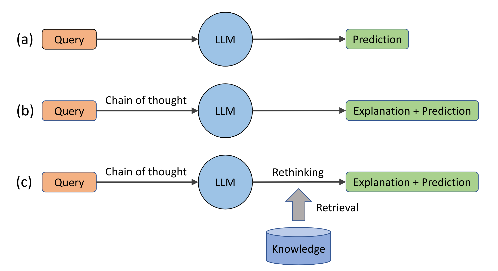
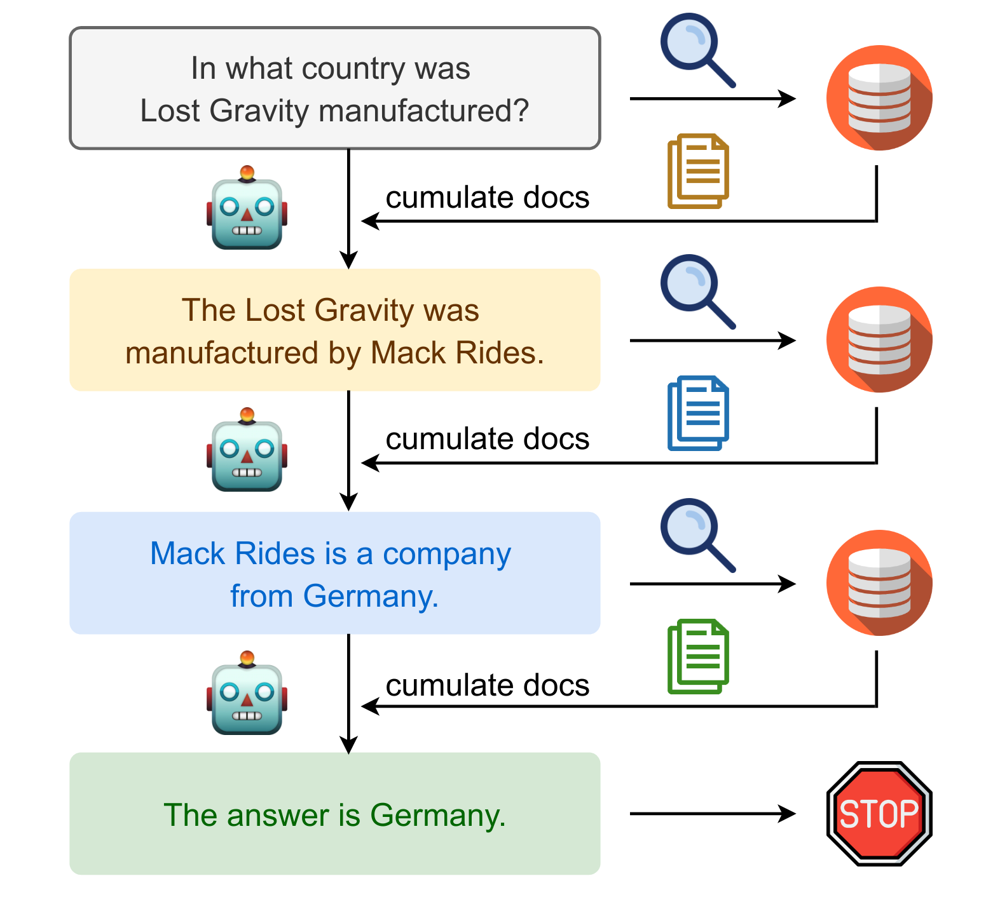

# Reasoning in Large Language Models
Reasoning with retrieval information in large language models.

## Rethinking with Retrieval
[Rethinking with Retrieval: Faithful Large Language Model Inference](https://arxiv.org/abs/2301.00303)
* Out-of-date, incorrect, or missing relevant knowledge in the pre-training corpus
* incorrect memorization of relevant knowledge during pre-training. 
* incorrect retrieval of relevant knowledge during inference stage 

## IR-CoT
[Interleaving Retrieval with Chain-of-Thought Reasoning for Knowledge-Intensive Multi-Step Questions](https://arxiv.org/abs/2212.10509)

